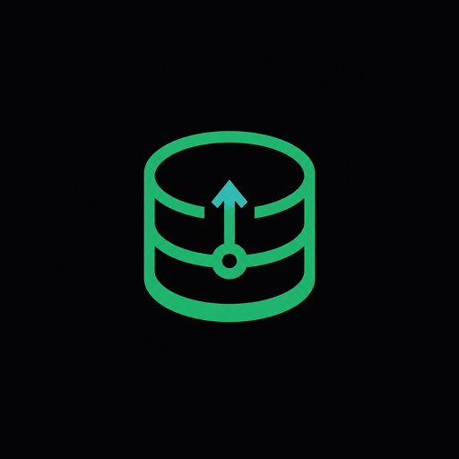

# AtlasHub Brand Board

> A practical brand reference derived from the existing AtlasHub product UI. This document defines and preserves the current visual language; it is not a redesign brief.

## Brand core

**Product:** AtlasHub  
**Category:** Self-hosted backend-as-a-service / infrastructure tooling  
**Audience:** Developers, small teams, homelab operators, and organizations that want database, storage, and API primitives under their own control.

**Positioning:** A calm, transparent, self-hosted backend platform that makes serious infrastructure approachable without hiding the underlying systems.

**Brand promise:** Your backend, your data, your infrastructure — with a focused dashboard that stays out of the way.

**Personality:**

- Technical, but welcoming
- Reliable, direct, and quietly confident
- Open-source minded and transparent
- Focused rather than flashy
- Practical, self-hosted, and operator-friendly

**Short descriptor:** Self-hosted backend infrastructure for builders.

## Visual direction

AtlasHub should feel like a well-made developer console: dark, precise, spacious, and easy to scan. The interface already establishes this direction through zinc surfaces, emerald status/action states, restrained borders, Geist typography, and Lucide-style line icons.

The visual system should communicate:

- **Control:** dark surfaces and clear hierarchy
- **Health:** emerald status accents and visible feedback
- **Structure:** database layers, grids, tables, and predictable spacing
- **Trust:** low-noise composition, readable type, and consistent states

## Color system

### Core palette

| Token | Hex | Role |
| --- | --- | --- |
| Ink | `#09090B` | App background, deepest canvas, dark theme base |
| Surface | `#18181B` | Sidebar, cards, elevated panels |
| Surface raised | `#27272A` | Hover states, secondary panels, controls |
| Border | `#3F3F46` | Dividers, card outlines, input boundaries |
| Text primary | `#F4F4F5` | Headings, important labels, primary content |
| Text secondary | `#A1A1AA` | Body copy, descriptions, secondary navigation |
| Text muted | `#71717A` | Metadata, helper text, low-emphasis labels |
| Atlas emerald | `#10B981` | Primary accent, active states, success, key actions |
| Atlas emerald light | `#34D399` | Hover emphasis, gradient endpoints already present in landing UI |
| Atlas teal | `#2DD4BF` | Optional supporting accent; use sparingly with emerald |
| Danger | `#EF4444` | Destructive actions and error states only |

### Color rules

- Keep the majority of the canvas in Ink, Surface, and neutral zinc tones.
- Use emerald for meaning, not decoration: active navigation, healthy states, primary CTAs, and the AtlasHub mark.
- Pair emerald with teal only where the existing landing-page gradient already calls for it.
- Avoid introducing purple, electric blue, orange, neon multicolor gradients, or warm editorial palettes.
- Maintain readable contrast for all text and state colors; never use emerald as a body-text replacement on dark surfaces at small sizes.

## Typography

**Primary typeface:** Geist  
**Technical/monospace typeface:** Geist Mono

| Use | Typeface | Guidance |
| --- | --- | --- |
| Product name and display headings | Geist | Bold or semibold, compact tracking, confident but not theatrical |
| Body copy and navigation | Geist | Regular/medium, short lines, high scanability |
| SQL, API paths, keys, IDs, metrics | Geist Mono | Use for technical values and code-like content only |
| Labels and metadata | Geist | Small, medium weight, muted zinc color |

Typography should remain compact and functional. Avoid decorative display fonts, excessive letter spacing, all-caps paragraphs, and overly large hero copy outside the existing landing-page context.

## Logo and icon

### Mark concept

The generated AtlasHub mark combines the existing database-cylinder metaphor with a small upward data/connection cue. It should read as infrastructure first and growth/flow second. The silhouette is intentionally simple so it remains recognizable as a favicon, sidebar mark, and PWA icon.

### Asset inventory

- Master generated raster: `dashboard/public/atlashub-icon.png`
- PWA icon: `dashboard/public/icon-512.png`
- Small PWA icon: `dashboard/public/icon-192.png`

### Usage

- Use the mark alone in compact UI contexts, app icons, loading states, and navigation rails.
- Use the mark with the `AtlasHub` wordmark when there is enough horizontal space.
- Preserve the dark background and the emerald/teal mark treatment used by the generated asset.
- Keep clear space around the mark equal to at least one quarter of its visible height.
- At 16–24px, prefer the strongest simple silhouette; do not add extra detail or a wordmark.

### Avoid

- Do not redraw the mark as a mascot, globe, mountain, or generic cloud.
- Do not place it on white, photographic, noisy, or gradient-heavy backgrounds.
- Do not stretch, rotate, outline, emboss, or add a drop shadow.
- Do not recolor it into blue/purple SaaS palettes.

## Shape, spacing, and UI language

- **Corners:** use the existing rounded-md to rounded-xl range; keep controls tighter than content cards.
- **Borders:** thin zinc borders with low visual noise; use accent borders only for active/hover feedback.
- **Elevation:** prefer surface contrast and borders over large shadows.
- **Spacing:** use predictable 4px-based spacing, with generous section gaps and compact control groups.
- **Icons:** Lucide-style outline icons, consistent stroke weight, 16–20px in navigation and controls.
- **Motion:** short, subtle transitions for color, border, and opacity. Avoid bouncy or decorative animation.
- **Data presentation:** favor tables, cards, stat blocks, charts, and visible status labels over ornamental graphics.

## Imagery and illustration

AtlasHub is an infrastructure product, so imagery should be secondary to the product UI. When supporting imagery is needed, use:

- abstract data layers, grids, nodes, storage, and connection motifs;
- dark neutral backgrounds with emerald highlights;
- restrained technical diagrams and product screenshots;
- generous negative space and crisp geometry.

Avoid stock-business photography, smiling-team clichés, glossy 3D servers, cyberpunk neon, and busy abstract backgrounds that compete with dashboard content.

## Voice and copy

**Voice:** clear, capable, calm, and concrete.

Prefer:

- “Database per project”
- “Run it on your own infrastructure”
- “Manage storage, keys, and APIs in one place”
- “Secure by default”

Avoid:

- vague superlatives such as “revolutionary” or “unlimited”;
- fear-based security copy;
- unnecessary enterprise jargon;
- copy that hides operational details behind marketing language.

### Copy formula

Lead with the capability, explain the practical benefit, then expose the control the user keeps. Example: “Each project gets an isolated PostgreSQL database, so your data stays separated and portable.”

## Brand do / do not

| Do | Do not |
| --- | --- |
| Keep the dark zinc + emerald foundation | Introduce a new visual palette |
| Make infrastructure concepts feel approachable | Turn the product into a flashy SaaS landing page |
| Use clear, operational language | Hide important details behind hype |
| Use the database/data-layer metaphor | Replace it with generic cloud imagery |
| Preserve Geist and Lucide-style UI patterns | Mix in decorative fonts or icon families |
| Let emerald indicate action or health | Use emerald everywhere as decoration |

## Implementation mapping

The current UI already expresses the brand board in these places:

- `dashboard/app/globals.css` — neutral dark/light tokens, Geist variables, radius system
- `dashboard/app/(public)/landing/page.tsx` — emerald/teal accent treatment and product positioning
- `dashboard/components/sidebar.tsx` — database mark, emerald active state, compact navigation language
- `dashboard/public/manifest.json` — dark PWA surface and AtlasHub icon references

No component, layout, or CSS changes are required to adopt this board. The generated icon assets are additive and match the icon paths already referenced by the PWA manifest.

## One-line north star

**AtlasHub is the calm, self-hosted control plane for your data and APIs.**
